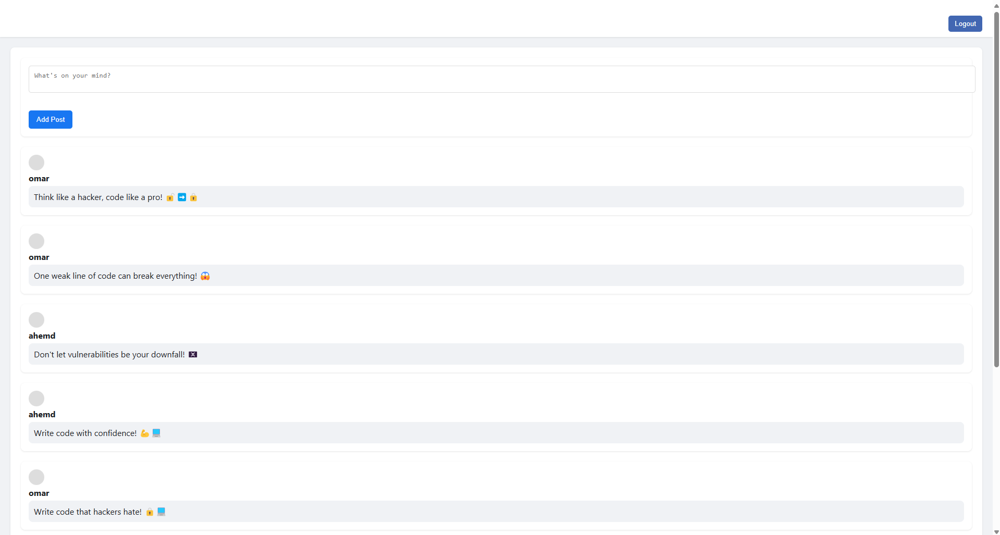
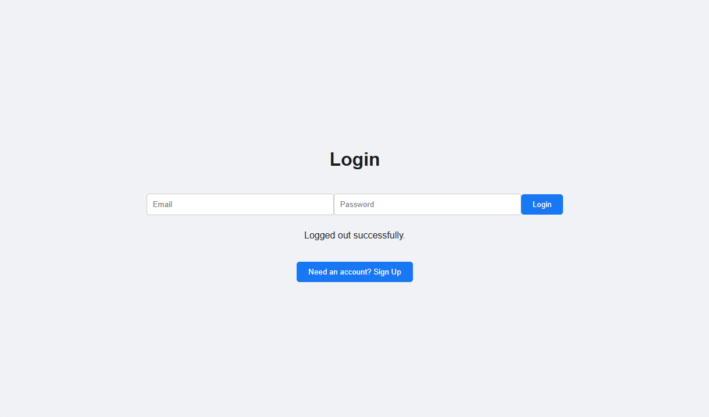
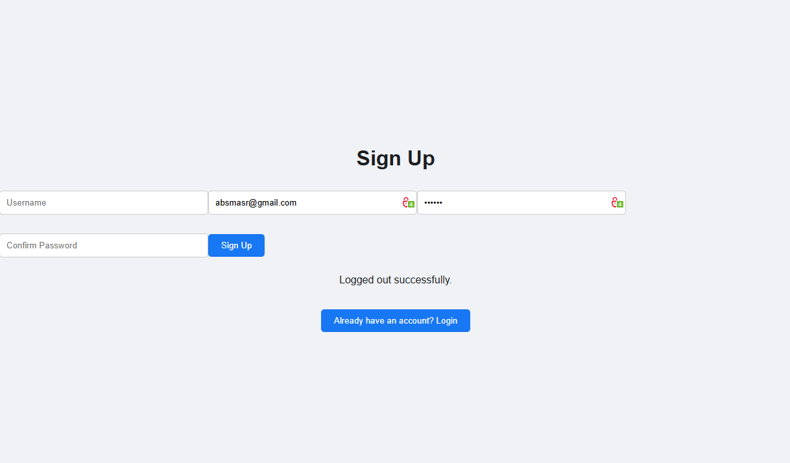
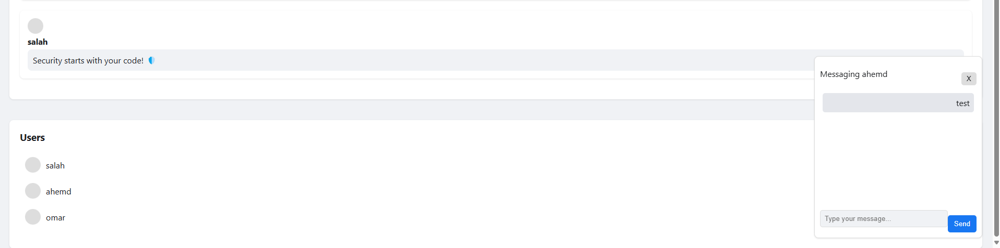

# Social Media Platform

  
  
  
  
  

## 📋 Project Description  
A simple social media platform built with **React** and **Supabase**, allowing users to create posts, chat privately, and interact seamlessly.

---
## 🖼️ Banner


---
## 🖼️ Screenshots  
### Home Page  
  

### Login Page  
  

### Signup Page  
  

### Messaging System  
  

---

## 🌟 Features  
- 🔑 **User Authentication** – Secure login and signup with Supabase  
- 📝 **Post Creation & Display** – Share thoughts with others  
- 👥 **User List** – See who’s online  
- 💬 **Private Messaging** – Chat with other users in real-time  

---

## Installation

1.  **Clone the repository:**

    ```bash
    git clone https://github.com/salahezzt120/Social-Media-Platform.git
    ```

2.  **Navigate to the project directory:**

    ```bash
    cd social-media-platform
    ```

3.  **Install dependencies:**

    ```bash
    npm install
    ```

## Configuration

1.  **Create a `.env` file** in the project root with the following variables:

    ```
    VITE_SUPABASE_URL=<your_supabase_url>
    VITE_SUPABASE_ANON_KEY=<your_supabase_anon_key>
    ```

    Replace `<your_supabase_url>` and `<your_supabase_anon_key>` with your Supabase project URL and anon key, respectively.

## Running the Project

1.  **Start the development server:**

    ```bash
    npm run dev
    ```

2.  **Open the application** in your browser at `http://localhost:5173`.

## Supabase Setup

1.  **Create a Supabase project** at [https://supabase.com/](https://supabase.com/).

2.  **Create the following tables** in your Supabase database:

    **users**

    ```sql
    CREATE TABLE users (
        id UUID PRIMARY KEY DEFAULT gen_random_uuid(),
        username VARCHAR(255) NOT NULL UNIQUE,
        email VARCHAR(255) NOT NULL UNIQUE,
        created_at TIMESTAMP WITH TIME ZONE DEFAULT timezone('utc', now())
    );
    ```

    **posts**

    ```sql
    CREATE TABLE posts (
        id UUID PRIMARY KEY DEFAULT gen_random_uuid(),
        user_id UUID NOT NULL REFERENCES users(id),
        content TEXT,
        created_at TIMESTAMP WITH TIME ZONE DEFAULT timezone('utc', now())
    );
    ```

    **messages**

    ```sql
    CREATE TABLE messages (
        id UUID PRIMARY KEY DEFAULT gen_random_uuid(),
        sender_id UUID NOT NULL REFERENCES users(id),
        receiver_id UUID NOT NULL REFERENCES users(id),
        content TEXT,
        created_at TIMESTAMP WITH TIME ZONE DEFAULT timezone('utc', now())
    );
    ```

3.  **Enable Authentication:**

    *   Go to Authentication > Providers and enable Email/Password authentication.

## Contributing

Contributions are welcome! Please feel free to submit pull requests.

## License

[MIT](LICENSE)
